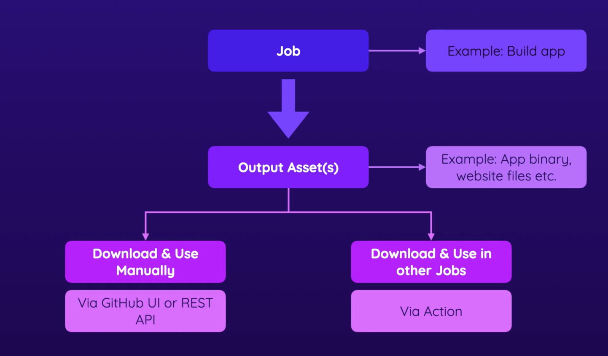

### Workflow 
```yml
name: Deploy Project
on: 
  push:
    branches:
      - master
      - main
  workflow_dispatch:
jobs:
  test:
    runs-on: ubuntu-latest
    steps:
      - name: Get-code
        uses: actions/checkout@v3
      - name: Install dependencies
        run: npm ci
      - name: Lint Code
        run: npm run lint
      - name: Run test
        run: npm run test
  build:
    needs: test
    runs-on: ubuntu-latest
    steps:
      - name: Get-code
        uses: actions/checkout@v3
      - name: Install dependencies
        run: npm ci
      - name: Build Project
        run: npm run build
      - name: Upload Artifacts
        # Get the details of actions from *https://github.com/actions/upload-artifact*
        uses: actions/upload-artifact@v4
        with:
          name: dist-files
          path: dist
  deployL:
    needs: build
    runs-on: ubuntu-latest
    steps:
      - name: Deploy
        run: echo "deploying....."
      - name: Downlaod Artifacts
        uses: actions/download-artifact@v4
        with:
          name: dist-file
      - name: Output Content
        run: ls -l
```